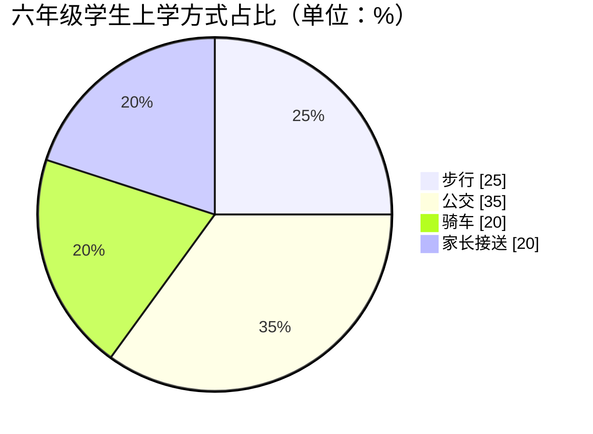
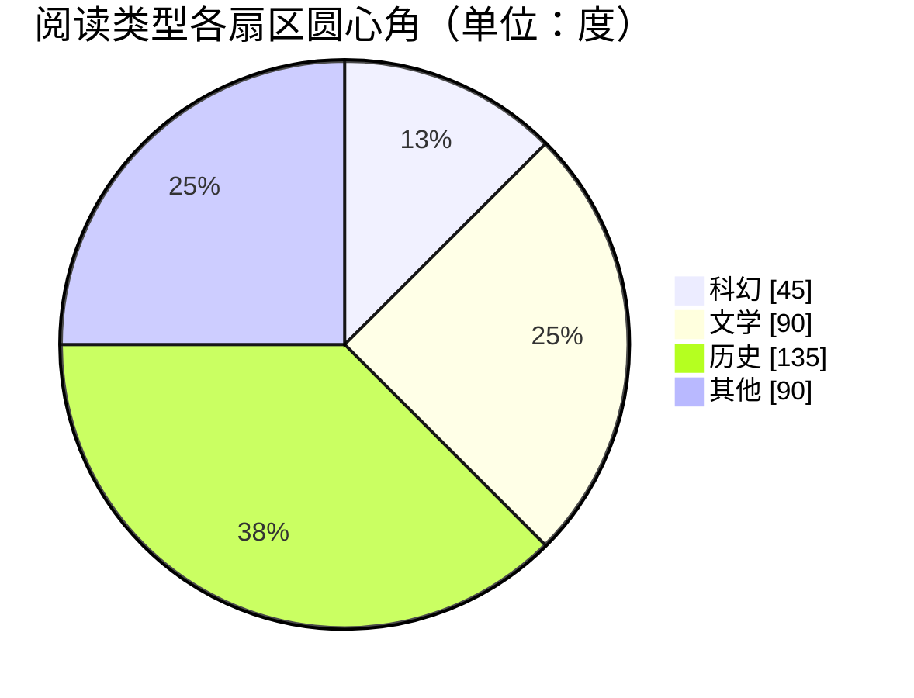

# 扇形统计图的读取

## 一句话

扇形统计图用整圆表示总体 `100%`，各扇形表示部分占总体的百分比；有总量才能由占比求部分量，有部分量才能反求总量。

## 典型题型（按难度）

| 难度 | 题型描述 | 状态 |
|---|---|---|
| L1 | 读出最大类别和占比 | 已写 |
| L2 | 从图例和扇区标注读出占比后求部分量 | 已写 |
| L3 | 从扇区图中读取圆心角，换算占比后反求总量 | 已写 |
| L4 | 用扇形合并关系求未直接标注的类别 | 已写 |

## 例题

### 例题 1

#### 题目

某班最喜欢的运动项目扇形统计图中，篮球占 `35%`，足球占 `25%`，乒乓球占 `20%`，其他占 `20%`。占比最大的项目是什么？

#### 难度

L1

#### 解题技巧

同一个总体中，直接比较各扇形百分比。

#### 步骤要点

1. 四个占比中 `35%` 最大。
2. `35%` 对应篮球。

#### 避坑思路

这里只能确定占比最大；没有全班人数，不能算出篮球具体人数。

#### 答案

篮球，占 `35%`。

---

### 例题 2

#### 题目

六年级共有 `200` 名学生。请根据下面的扇形统计图，求步行上学的学生人数。

图中图例类别依次包含步行、公交、骑车和家长接送。

#### 难度

L2

#### 解题技巧

先用图例找到“步行”扇区，读出其占总体的百分比，再求部分量。

#### 步骤要点

1. 从图中读出步行占 `25%`。
2. 步行人数：`200×25%=50（人）`。

#### 避坑思路

不能只凭扇区颜色或大小猜类别；先对照图例，再读取该类别的标注。

#### 答案

步行上学有 `50` 人。

---

### 例题 3

#### 题目

某班最喜欢科幻读物的有 `12` 人。请根据下面的扇形统计图，求全班人数。

图中图例类别依次包含科幻、文学、历史和其他。

#### 难度

L3

#### 解题技巧

先从图中读取科幻扇区的圆心角，再用角度÷`360°` 得占比，最后由部分量反求总量。

#### 步骤要点

1. 从图中读出科幻扇区圆心角为 `45°`。
2. 科幻类占全班：`45°÷360°=12.5%`。
3. 全班人数：`12÷12.5%=12÷0.125=96（人）`。

#### 避坑思路

图中标注的是圆心角，不是人数或百分数；反求总人数要用部分量除以其对应占比。

#### 答案

全班有 `96` 人。

---

### 例题 4

#### 题目

一项调查的扇形统计图中，A 占 `30%`，B 占 `25%`，C 占 `15%`，D 未标注。已知 A 比 D 多 `18` 人。调查总人数是多少？

#### 难度

L4

#### 解题技巧

先用整圆 `100%` 识别未标注的 D 占比，再把“人数差”对应到“百分比差”。

#### 步骤要点

1. D 占 `100%-30%-25%-15%=30%`。
2. A 与 D 的占比相同，所以人数应相同。
3. 题目又说 A 比 D 多 `18` 人，两个条件矛盾，不存在满足条件的总人数。

#### 避坑思路

不要见到数字就强行列式；先检查扇形合计是否为 `100%`，再判断数据是否自洽。

#### 答案

条件矛盾，无法求出总人数；按占比 A 和 D 都是 `30%`，人数差应为 `0`。

## 常见坑 / 易混

- 把扇形的百分比直接当具体数量。
- 未知总量时仍强求某类具体人数。
- 忘记检查各类占比合计是否为 `100%`。

## 年级与单元

- 六年级上册「扇形统计图」。

## 思维横向题（L4）

例题 4 先用“整圆=100%”补齐未知扇形，再做数据自洽性检查，而非对矛盾数据繁算。

## 关联

- **相近知识点**：[跨图表数据推断](./kp_s10_chart_data_inference.md)、[百分数的意义与百分率](../S02-小数与百分数/kp_s02_percent_meaning.md)
- **练习材料**：暂无对应练习记录
- **素质跟踪弱项**：暂无对应弱项记录
